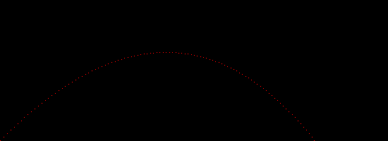
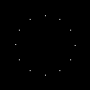
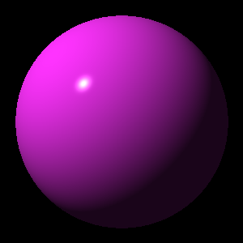
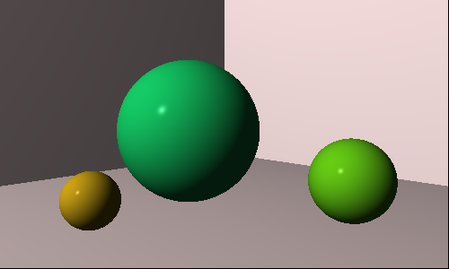
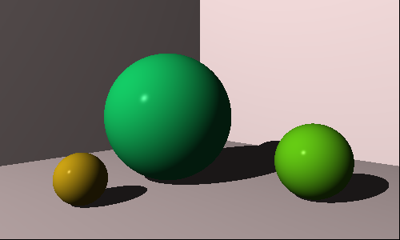
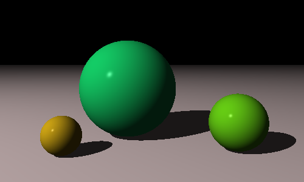
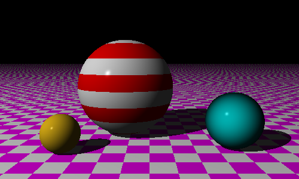

This is my pet project while learning Rust.
I implemented ray tracing following the awesome book [The Ray Tracer Challenge](http://raytracerchallenge.com/).

### Images from some chapters:

#### Chapter 02:

#### Chapter 04:

#### Chapter 05:

#### Chapter 06:

#### Chapter 07:

#### Chapter 08:

#### Chapter 09:

### Chapter 10:
