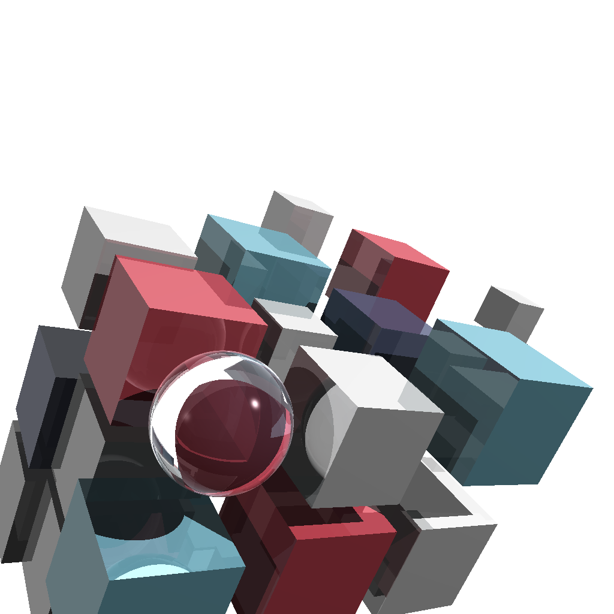

This is my pet project while learning Rust.
I implemented ray tracing following this awesome book [The Ray Tracer Challenge](http://raytracerchallenge.com/).

### How to run
```
cargo run examples/yaml/refraction.yaml examples/images/refraction.png
```

### Examples



